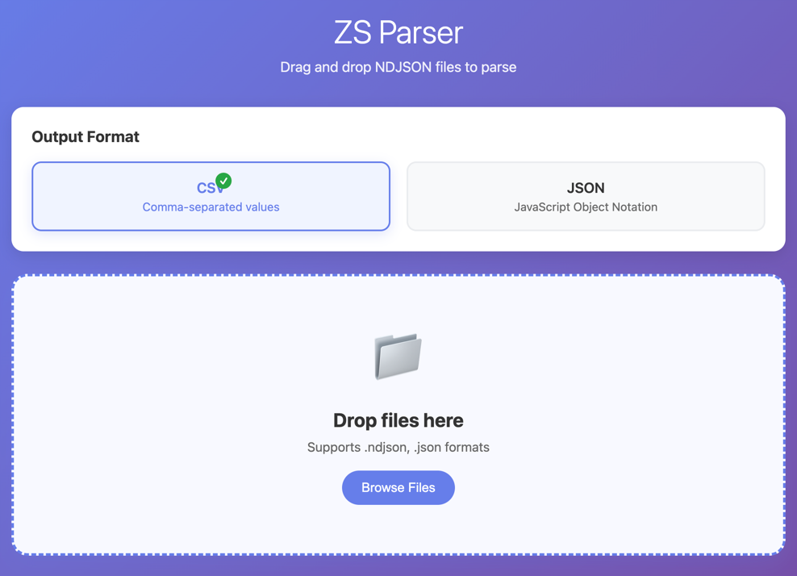

## Installation

Clone the repo and install it.
```
./install.sh
```
The app will install and show up 

After you install it, you can launch it by

```
./run.sh  # Or `npm start`
```


## Supported platforms

The parser reduces the items Zeeschuimer captured to a flat table, deduplicated by post:

| Platform | Fields |
|----------|--------|
| Facebook | `post_id`, `post_url`, `creation_time`, `attachments`, `text`, `total_reaction_count`, `reactions`, `comment_count`, `share_count` |
| TikTok | `post_id`, `post_url`, `creation_time`, `attachments`, `text`, `author_name`, `author_id`, `like_count`, `comment_count`, `share_count`, `play_count` |
| X/Twitter | `post_id`, `post_url`, `creation_time`, `attachments`, `text`, `author_name`, `author_id`, `like_count`, `retweet_count`, `reply_count`, `quote_count`, `view_count`, `retweeted_from`, `promoted` |
| Threads | `post_id`, `post_url`, `creation_time`, `attachments`, `text`, `author_name`, `author_id`, `like_count`, `reply_count`, `repost_count`, `reposted_from` |

Items from other platforms are parsed as if they were Facebook posts.

A retweet's or repost's own text is empty or cut off, so the text, media and engagement counts of the post that was
retweeted or reposted are used, while `author_name` and `author_id` stay whoever retweeted or reposted it and
`retweeted_from`/`reposted_from` name the original author.

The same parsers are built into the Zeeschuimer fork at https://github.com/andyfcx/zeeschuimer, which can export
parsed data straight from the browser; both produce the same output.

## CLI Usage 

Parses data comes from Zeeshuimer, a firefox plugin.
Clone the repo and install it.
```
pip install . 
```
After install, there would be a new command `zs-parser`
The CLI interface supports pipe
```
zs-parser data.ndjson
zs-parser data.json > out.json
cat data.ndjson | zs-parser
head -n 5 data.ndjson | zs-parser > out.json
```
